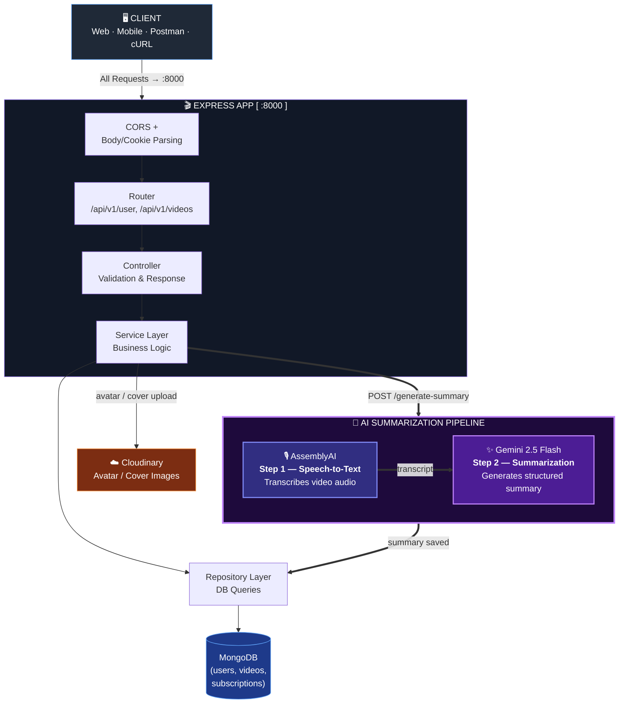

<div align="center">

```
██╗   ██╗ ██████╗ ██╗   ██╗████████╗██╗   ██╗██████╗ ███████╗
╚██╗ ██╔╝██╔═══██╗██║   ██║╚══██╔══╝██║   ██║██╔══██╗██╔════╝
 ╚████╔╝ ██║   ██║██║   ██║   ██║   ██║   ██║██████╔╝█████╗  
  ╚██╔╝  ██║   ██║██║   ██║   ██║   ██║   ██║██╔══██╗██╔══╝  
   ██║   ╚██████╔╝╚██████╔╝   ██║   ╚██████╔╝██████╔╝███████╗
   ╚═╝    ╚═════╝  ╚═════╝    ╚═╝    ╚═════╝ ╚═════╝ ╚══════╝

 ██████╗██╗      ██████╗ ███╗   ██╗███████╗
██╔════╝██║     ██╔═══██╗████╗  ██║██╔════╝
██║     ██║     ██║   ██║██╔██╗ ██║█████╗  
██║     ██║     ██║   ██║██║╚██╗██║██╔══╝  
╚██████╗███████╗╚██████╔╝██║ ╚████║███████╗
 ╚═════╝╚══════╝ ╚═════╝ ╚═╝  ╚═══╝╚══════╝
```

# 🎬 YouTube Clone Backend
### *A Layered, Production-Ready Video Platform API with AI Summarization*

---


-red?style=flat-square)


</div>

---

## 📋 Table of Contents

- [System Overview](#-system-overview)
- [Key Features](#-key-features)
- [Architecture](#-architecture)
- [Layer Responsibilities](#-layer-responsibilities)
- [Tech Stack](#-tech-stack)
- [Prerequisites](#-prerequisites)
- [Installation & Setup](#-installation--setup)
- [Environment Configuration](#-environment-configuration)
- [API Routes](#-api-routes)
- [Authentication Flow](#-authentication-flow)
- [AI Summarization Flow](#-ai-summarization-flow)
- [Project Structure](#-project-structure)
- [Error Reference](#-error-reference)
- [Troubleshooting](#-troubleshooting)
- [Roadmap](#-roadmap)

---

## 🌐 System Overview

The **YouTube Clone Backend** is a single-service Node.js API that powers a YouTube-style video platform — covering user registration and authentication, profile media (avatar/cover image) uploads, and **AI-powered video summarization**.

Unlike a microservices system, this project runs as **one Express application** with a strict **layered architecture**: requests flow from routes → controllers → services → repositories → the database, keeping business logic, data access, and HTTP handling cleanly separated. External capabilities — file storage, transcription, and summarization — are delegated to **Cloudinary**, **AssemblyAI**, and **Google Gemini** respectively.

---

## 🎯 Key Features

### 👤 User Management & Authentication
- Registration with unique username + Gmail-validated email
- Password hashing via **bcrypt**
- **JWT access + refresh token** authentication
- Refresh tokens readable from cookies or request body
- Logout with token invalidation

### 📹 Video & Subscription Data
- Video metadata modeled via Mongoose (`video.models.js`)
- Channel subscriptions modeled via `subscription.models.js`
- Repository layer isolates all direct database queries

### 🤖 AI Video Summarization
- Speech-to-text transcription via **AssemblyAI**
- Summary generation via **Google Gemini 2.5 Flash**
- Summaries persisted on the video document and retrievable on demand
- Async generation with a separate retrieval endpoint

### 📦 Media Handling
- **Multer** for multipart form parsing
- **Cloudinary** for avatar/cover image storage
- Structured `{ url, publicId }` shape for stored media

### 🔒 Security & Response Consistency
- CORS restricted to a configured frontend origin
- Custom `apiError` and `apiResponse` classes for uniform payloads
- `asyncHandler` wrapper to centralize error handling across controllers

---

## 🏗️ Architecture



---

## 🧩 Layer Responsibilities

### 🚪 Routes — `src/routes/`
Maps HTTP verbs and paths (`user.routes.js`) to controller functions. No logic lives here beyond wiring middleware (e.g. `multer`, `auth`) to a handler.

---

### 🎯 Controllers — `src/controllers/`
Parses and validates requests (`user.controllers.js`, `summary.controller.js`), calls into the service layer, and shapes the final `apiResponse`/`apiError` payload. Wrapped in `asyncHandler` so thrown errors reach a central handler.

---

### ⚙️ Services — `src/services/`
Holds business logic and third-party orchestration (`summary.service.js`) — e.g. kicking off AssemblyAI transcription, then passing the transcript to Gemini for summarization.

---

### 🗄️ Repositories — `src/repositories/`
Owns all direct database access (`video.repository.js`), keeping Mongoose queries out of controllers and services.

---

### 🧱 Models — `src/models/`
Mongoose schemas for `user.models.js`, `video.models.js`, and `subscription.models.js`.

---

### 🛠️ Utils & Middlewares
- `apiErrors.js` / `apiResponse.js` — consistent success/error payload shapes
- `asyncHandler.js` — wraps async route handlers
- `cloudinary.js` — upload helper
- `isgmail.js` — email domain validation
- `assemblyai.js` / `gemini.js` — AI provider clients
- `autho.middlewares.js` — JWT verification
- `multer.middlewares.js` — multipart upload handling

---

## 🛠️ Tech Stack

| Technology | Role |
|:-----------|:-----|
| **Node.js** | Runtime |
| **Express.js** | HTTP server framework |
| **MongoDB + Mongoose** | Database & ODM |
| **JWT (jsonwebtoken)** | Access + refresh token authentication |
| **bcrypt** | Password hashing |
| **Multer** | Multipart form / file upload handling |
| **Cloudinary** | Avatar & cover image storage |
| **AssemblyAI** | Speech-to-text transcription |
| **@google/generative-ai (Gemini 2.5 Flash)** | AI-generated video summaries |
| **Axios** | HTTP client for provider calls |

---

## ✅ Prerequisites

Before running the project, make sure the following are available:

```
Node.js       ≥ 18.x    →  https://nodejs.org
npm           ≥ 9.x     →  comes with Node.js
MongoDB       any        →  local instance or MongoDB Atlas
Cloudinary    account    →  https://cloudinary.com
AssemblyAI    account    →  https://www.assemblyai.com
Google Gemini API key    →  https://ai.google.dev
```

Verify installations:
```bash
node --version
npm --version
mongod --version
```

---

## 🚀 Installation & Setup

### Step 1 — Clone the Repository

```bash
git clone <your-repo-url>
cd "Youtube Clone"
```

### Step 2 — Install Dependencies

```bash
npm install
```

### Step 3 — Configure Environment Variables

```bash
cp .env.example .env
# Edit .env with your MongoDB, JWT, Cloudinary, AssemblyAI, and Gemini credentials
```

See [Environment Configuration](#-environment-configuration) below for the full variable list.

### Step 4 — Start the Server

```bash
# Development (hot reload via nodemon)
npm run dev

# Production
npm run start
```

### Step 5 — Verify the Server Is Running

```bash
curl http://localhost:8000/api/v1/user/login
# → a JSON response confirms the server and routes are reachable
```

---

## 🔧 Environment Configuration

### Root `.env`

```env
# Server
PORT=8000
NODE_ENV=development
CORS_ORIGIN=http://localhost:3000

# Database
MONGODB_URI=mongodb://localhost:27017/youtube-clone

# Authentication
ACCESS_TOKEN_SECRET=your_strong_secret_key
ACCESS_TOKEN_EXPIRY=1d
REFRESH_TOKEN_SECRET=your_refresh_secret
REFRESH_TOKEN_EXPIRY=10d

# Media Storage
CLOUDINARY_CLOUD_NAME=your_cloud_name
CLOUDINARY_API_KEY=your_api_key
CLOUDINARY_API_SECRET=your_api_secret

# AI Summarization
ASSEMBLYAI_API_KEY=your_assemblyai_key
GEMINI_API_KEY=your_gemini_key
```

| Variable | Required | Description |
|:---------|:--------:|:-------------|
| `PORT` | Yes | Port used by the Express server |
| `MONGODB_URI` | Yes | Full MongoDB connection string used by Mongoose |
| `CORS_ORIGIN` | Yes | Frontend origin allowed to make credentialed cross-origin requests |
| `ACCESS_TOKEN_SECRET` | Yes | Secret used to sign access tokens |
| `ACCESS_TOKEN_EXPIRY` | Yes | Access token lifetime (e.g. `15m`, `1h`, `1d`) |
| `REFRESH_TOKEN_SECRET` | Yes | Secret used to sign refresh tokens — keep distinct from the access secret |
| `REFRESH_TOKEN_EXPIRY` | Yes | Refresh token lifetime (e.g. `10d`) |
| `CLOUDINARY_CLOUD_NAME` | Yes | Cloudinary cloud name for media uploads |
| `CLOUDINARY_API_KEY` | Yes | Cloudinary API key |
| `CLOUDINARY_API_SECRET` | Yes | Cloudinary API secret — never commit this value |
| `ASSEMBLYAI_API_KEY` | Yes | AssemblyAI key for transcription |
| `GEMINI_API_KEY` | Yes | Google Gemini key for summary generation |

---

## 🛣️ API Routes

> **Base URL:** `http://localhost:8000`

---

### 🟢 Public Routes — No Token Required

#### 👤 User Auth → `/api/v1/user`

| Method | Endpoint | Description |
|:------:|:---------|:------------|
| `POST` | `/api/v1/user/register` | Register a new user (multipart form) |
| `POST` | `/api/v1/user/login` | Login with email or username |
| `POST` | `/api/v1/user/refresh-token` | Exchange a refresh token for a new token pair |

**Register**
```http
POST http://localhost:8000/api/v1/user/register
Content-Type: multipart/form-data

fullName: "Ritesh Tyagi"
email: "ritesh@gmail.com"
username: "ritesh"
password: "SecurePassword123"
avatar: <file>          # required
coverImage: <file>      # optional
```
```json
{
  "data": {
    "_id": "67cabc1234567890abcdef12",
    "username": "ritesh",
    "email": "ritesh@gmail.com",
    "fullName": "Ritesh Tyagi",
    "avatar": { "url": "https://res.cloudinary.com/.../avatar.jpg", "publicId": "avatar_public_id" },
    "coverImage": { "url": "https://res.cloudinary.com/.../cover.jpg", "publicId": "cover_public_id" },
    "watchHistory": []
  },
  "statusCode": 201,
  "message": "User registered successfully",
  "success": true
}
```

**Login**
```http
POST http://localhost:8000/api/v1/user/login
Content-Type: application/json

{
  "email": "ritesh@gmail.com",
  "password": "SecurePassword123"
}
```
> You can log in with `username` instead of `email`.

```json
{
  "data": {
    "user": { "_id": "67cabc1234567890abcdef12", "username": "ritesh", "email": "ritesh@gmail.com" },
    "accessToken": "jwt_access_token",
    "refreshToken": "jwt_refresh_token"
  },
  "statusCode": 200,
  "message": "User loggedIn successfully",
  "success": true
}
```

---

### 🔴 Protected Routes — Token Required

> Pass the access token as `Authorization: Bearer <token>`, or rely on the HTTP-only cookie.

| Method | Endpoint | Description |
|:------:|:---------|:------------|
| `POST` | `/api/v1/user/logout` | Invalidate the current session |
| `POST` | `/api/v1/videos/:videoId/generate-summary` | Transcribe + summarize a video |
| `GET` | `/api/v1/videos/:videoId/summary` | Retrieve a previously generated summary |

```http
POST http://localhost:8000/api/v1/user/logout
Authorization: Bearer <access_token>
```
```json
{ "data": {}, "statusCode": 200, "message": "User loggedout", "success": true }
```

```http
POST http://localhost:8000/api/v1/videos/VIDEO_ID/generate-summary
```
```json
{
  "data": { "videoId": "...", "summary": "...", "generatedAt": "2026-08-04T10:30:00Z" },
  "message": "Video summary generated successfully",
  "statusCode": 200
}
```

> ⚡ Generation can take **30–120 seconds** on first run; retrieval afterward is near-instant since the summary is cached on the document.

---

## 🔑 Authentication Flow

```
  Client                Express App           Auth Middleware        Controller
    │                       │                       │                    │
    ├──POST /register───────▶│                       │                    │
    │                       ├──────forward───────────────────────────────▶│
    │◀────201 Created────────┤◀─────────user created──────────────────────┤
    │                       │                       │                    │
    ├──POST /login───────────▶│                       │                    │
    │                       ├──────forward───────────────────────────────▶│
    │◀──{ accessToken, refreshToken }─────────────────────────────────────┤
    │                       │                       │                    │
    ├──POST /logout──────────▶│                       │                    │
    │  Authorization: Bearer  ├────verify JWT─────────▶│                    │
    │                       │◀───{ valid: true }─────┤                    │
    │                       ├──────forward───────────────────────────────▶│
    │◀──── logged out ────────┤◀─────────token cleared─────────────────────┤
```

---

## 🤖 AI Summarization Flow

```
  Controller             Service Layer            AssemblyAI              Gemini
      │                       │                       │                     │
      ├──generate-summary─────▶│                       │                     │
      │                       ├──submit audio─────────▶│                     │
      │                       │◀── transcript ready ───┤                     │
      │                       ├──send transcript──────────────────────────▶│
      │                       │◀──────────── structured summary ────────────┤
      │◀──save + respond──────┤                       │                     │
```

The controller returns immediately once the summary is generated and persisted; subsequent `GET .../summary` calls read the cached result from MongoDB instead of re-running transcription.

---

## 📁 Project Structure

```
Youtube Clone/
│
├── public/
│   └── assets/
│
├── src/
│   ├── controllers/
│   │   ├── user.controllers.js
│   │   └── summary.controller.js        ✨ AI Summarization
│   │
│   ├── services/
│   │   └── summary.service.js           ✨ AI Summarization
│   │
│   ├── repositories/
│   │   └── video.repository.js
│   │
│   ├── models/
│   │   ├── user.models.js
│   │   ├── video.models.js
│   │   └── subscription.models.js
│   │
│   ├── routes/
│   │   └── user.routes.js
│   │
│   ├── middlewares/
│   │   ├── autho.middlewares.js         ← JWT verification
│   │   └── multer.middlewares.js        ← Multipart upload handling
│   │
│   ├── utils/
│   │   ├── apiErrors.js
│   │   ├── apiResponse.js
│   │   ├── asyncHandler.js
│   │   ├── cloudinary.js
│   │   ├── isgmail.js
│   │   ├── assemblyai.js                ✨ Transcription
│   │   └── gemini.js                    ✨ AI Summarization
│   │
│   ├── db/
│   │   └── index.js                     ← MongoDB connection
│   │
│   ├── constants.js
│   ├── app.js                           ← Express app setup
│   └── index.js                         ← Server entry point
│
├── .env
├── .env.example
├── .gitignore
├── package.json
├── package-lock.json
└── README.md
```

---

## ❌ Error Reference

| Code | Message | Cause |
|:----:|:--------|:------|
| `400` | `Invalid input` | Malformed or missing request fields |
| `401` | `Unauthorized` | Missing or expired access token |
| `403` | `Forbidden` | Insufficient permissions |
| `404` | `Not found` | Resource doesn't exist |
| `409` | `Conflict` | Duplicate username/email |
| `500` | `Internal Server Error` | Unhandled exception or DB failure |

**Standard error shape:**
```json
{
  "statusCode": 400,
  "data": null,
  "message": "Error message",
  "success": false,
  "errors": []
}
```

**Standard success shape:**
```json
{
  "data": {},
  "statusCode": 200,
  "message": "Success message",
  "success": true
}
```

---

## 🔧 Troubleshooting

| Problem | Likely Cause | Fix |
|:--------|:------------|:----|
| `401 Unauthorized` on protected routes | Missing/expired access token | Re-authenticate via `/login` or `/refresh-token` |
| `MongooseServerSelectionError` | MongoDB not running or wrong `MONGODB_URI` | Start MongoDB / verify Atlas connection string |
| Avatar upload fails | Missing Cloudinary credentials | Check `CLOUDINARY_*` variables in `.env` |
| `generate-summary` times out | AssemblyAI/Gemini key invalid or quota exceeded | Verify `ASSEMBLYAI_API_KEY` and `GEMINI_API_KEY` |
| CORS errors from frontend | `CORS_ORIGIN` mismatch | Set `CORS_ORIGIN` to your frontend's exact origin |
| `Port already in use` | Another process on `:8000` | `kill $(lsof -t -i:8000)` then restart |

---

## 🗺️ Roadmap

```
Phase 1 (Current) ✅
├── User authentication
├── Media uploads
└── AI video summarization

Phase 2
├── Comment system
├── Playlist management
└── Video recommendations

Phase 3
├── Subscription system
├── Live streaming
└── Advanced analytics

Phase 4
├── Mobile app API optimization
├── Webhook support
└── GraphQL API
```

---

<div align="center">

**Built with Node.js · Express · MongoDB · Mongoose · Cloudinary · Gemini · AssemblyAI**

*1 Service · Layered Architecture · AI-Powered*

🎬 **Happy Streaming!** 🎬

</div>